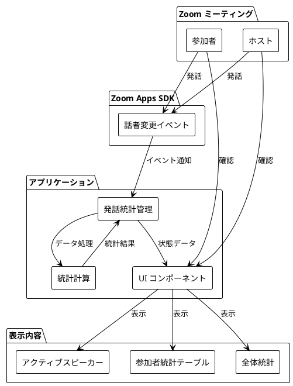

# 対話促進・議論支援型アプリケーション

## 効果・効用、技術的実現性、具体性

最終更新日: 2025 年 1 月

---

## 目次

1. [効果・効用](#効果効用)
2. [技術的実現性](#技術的実現性)
3. [具体性](#具体性)

---

## はじめに

本資料では、Zoom ミーティング内で動作する対話促進・議論支援型アプリケーションについて、効果・効用、技術的実現性、具体性を説明いたします。

なお、本アプリケーションは Zoom Apps SDK を使用して実装されており、Zoom ミーティング内でのみ動作するため、Web 上での POC（Proof of Concept）の公開ができませんでした。資料にて失礼いたします。

## 概要

本アプリケーションは、Zoom ミーティング内で参加者の発話状況をリアルタイムで可視化し、議論への積極的な参加を促進することを目的とした Zoom Apps アプリケーションです。

主な機能として、参加者ごとの発話回数・発話時間・発話シェア・バランススコアをリアルタイムで集計・表示し、ホストのファシリテーション支援と参加者の自己調整を支援します。Zoom Apps SDK のイベントベースの実装により、参加者情報の取得や発話状況の検出を行い、React + TypeScript で構築された UI で統計情報をリアルタイムに表示します。

---

## 効果・効用

### 効果の概要

| カテゴリ                   | 効果・期待される行動変化                                                       |
| -------------------------- | ------------------------------------------------------------------------------ |
| **発話状況の可視化**       | 参加者が自分の発話状況を客観的に把握し、発話バランスを自発的に調整する         |
| **ファシリテーション支援** | ホストが発話バランスを一目で把握し、発話の偏りを早期発見して適切な介入ができる |
| **議論の流れの可視化**     | 現在話している人が明確に表示され、参加者が適切なタイミングで発言できる         |
| **公平な参加の可視化**     | 公平な参加が数値化され、グラウンドルールが自然に遵守される                     |
| **役割分担の可視化**       | 各参加者の役割が可視化され、参加者が自分の役割を認識して適切に行動できる       |
| **教育効果**               | 自己調整能力・コミュニケーション能力が向上し、発話スキルが身につく             |

### システム構成図

---

## 技術的実現性

### 実装状況

| 項目             | 技術スタック              | 備考                                               |
| ---------------- | ------------------------- | -------------------------------------------------- |
| **SDK 連携**     | Zoom Apps SDK             | イベントベースの実装                               |
| **話者検出**     | イベント駆動              | タイムアウトによる話者解除                         |
| **発話時間測定** | タイムスタンプ計算        | 1 秒単位で集計                                     |
| **統計計算**     | React + TypeScript        | 発話回数・総時間・平均時間・シェア・バランススコア |
| **UI 表示**      | React 18.2.0 + Vite 5.0.8 | リアルタイム更新                                   |

### 拡張可能性

| 機能                              | 実現性 | 実装方法                      | 必要な拡張                                     |
| --------------------------------- | ------ | ----------------------------- | ---------------------------------------------- |
| **学生の属性の可視化**            | 高     | 参加者名から属性情報を抽出    | 属性フィールド追加・統計計算・UI フィルター    |
| **ブレイクアウトルーム対応**      | 中高   | ルーム状態を検知              | ルームごとの統計管理・比較機能・閲覧モード拡張 |
| **AI によるディスカッション要約** | 中     | 音声録音 → 音声認識 → AI 要約 | 録音機能・音声認識 API・AI 要約 API・表示 UI   |

---

## 具体性

### 使用シナリオ

| シナリオ                                   | 流れ                                                                                                             | 期待される効果                                                 |
| ------------------------------------------ | ---------------------------------------------------------------------------------------------------------------- | -------------------------------------------------------------- |
| **オンライン授業でのディスカッション**     | 教師がアプリ起動 学生参加 発話統計表示 教師が発話の偏りを発見 学生に発言を促す 学生が自発的に発言 | 全員が議論に参加、発話のバランスが取れる                       |
| **ブレイクアウトルームでのグループワーク** | ブレイクアウトルーム作成 各ルームで統計集計 ホスト閲覧モードで全ルーム確認 発話が偏っているルームに介入 | 各グループで公平な参加が実現、教師が複数グループを効率的に管理 |
