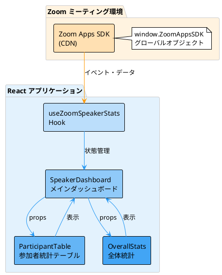
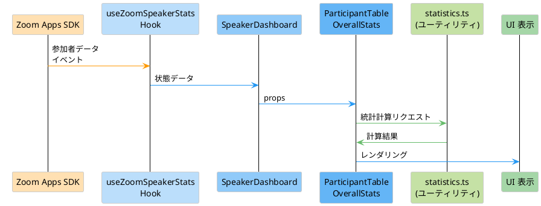
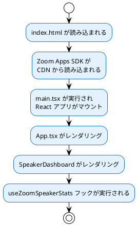
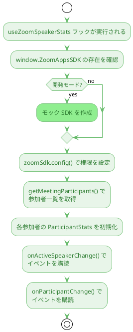
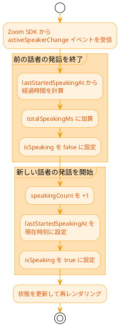
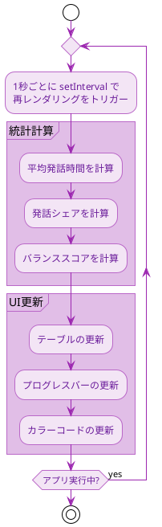

# Zoom 発話者リアルタイム分析アプリ 仕様書

## 文書情報

- **プロジェクト名**: Zoom 発話者リアルタイム分析
- **バージョン**: 0.0.1
- **作成日**: 2024 年
- **最終更新日**: 2024 年

---

## 目次

1. [プロジェクト概要](#プロジェクト概要)
2. [目的と背景](#目的と背景)
3. [技術スタック](#技術スタック)
4. [システムアーキテクチャ](#システムアーキテクチャ)
5. [機能仕様](#機能仕様)
6. [データモデル](#データモデル)
7. [コンポーネント構成](#コンポーネント構成)
8. [処理フロー](#処理フロー)
9. [開発環境](#開発環境)
10. [デプロイ方法](#デプロイ方法)
11. [今後の拡張予定](#今後の拡張予定)

---

## プロジェクト概要

### 概要

Zoom ミーティング内で動作する Zoom Apps アプリケーションです。参加者の発話状況をリアルタイムで可視化し、ホストのファシリテーション支援と参加者の自己調整を促進します。

### 主な特徴

- ✅ リアルタイムでの発話統計の集計と表示
- ✅ アクティブスピーカーの検出と表示
- ✅ 発話バランスの可視化
- ✅ 参加者ごとの詳細統計
- ✅ 全体統計の表示

---

## 目的と背景

### 目的

1. **ホストがファシリテートしやすくなること**

   - 誰が多く話しているか、少なく話しているかを一目で把握
   - 発話のバランスが取れているかを判断
   - 介入が必要なタイミングを把握

2. **参加者たちが自分で発言のバランスを取ろうとすること**
   - 自分の発話状況を客観的に把握
   - 他の参加者との比較
   - 発話の偏りに気づく

### 背景

オンラインミーティングや e ラーニングの場面で、発話のバランスが取れていないことが問題となることがあります。このアプリは、そのような問題を可視化することで、より効果的なコミュニケーションを支援します。

---

## 技術スタック

### フロントエンド

- **React 18.2.0**: UI フレームワーク
- **TypeScript 5.2.2**: 型安全性を確保
- **Vite 5.0.8**: ビルドツール・開発サーバー

### 外部ライブラリ

- **Zoom Apps SDK**: Zoom ミーティングとの連携
  - CDN から読み込み: `https://appssdk.zoom.us/sdk.min.js`
  - グローバルオブジェクト: `window.ZoomAppsSDK`

### 開発ツール

- **@vitejs/plugin-react**: Vite の React プラグイン
- **TypeScript**: 型チェック

### スタイリング

- **CSS Modules**: コンポーネント単位でのスタイル管理
- **素の CSS**: グローバルスタイル

---

## システムアーキテクチャ

### 全体構成



### データフロー



---

## 機能仕様

### 1. アクティブスピーカーの表示

**機能**: 現在話している人を目立つ形で表示

**対応コンポーネント**: `SpeakerDashboard.tsx`（アクティブスピーカーセクション）

**表示内容**:

- 参加者の表示名
- 現在の発話時間（リアルタイム更新）
- アニメーション効果（点滅アイコン）

**更新頻度**: 1 秒ごと

**データソース**: `useZoomSpeakerStats` フックの `currentSpeaker` と `currentSpeakerId`

### 2. 参加者統計テーブル

**機能**: 参加者ごとの詳細な発話統計を表示

**対応コンポーネント**: `ParticipantTable.tsx`

**表示項目**:

| 項目           | 説明                             | 計算方法                                      | 計算関数（utils/statistics.ts）  |
| -------------- | -------------------------------- | --------------------------------------------- | -------------------------------- |
| 表示名         | 参加者の表示名                   | Zoom SDK から取得                             | -                                |
| 発話回数       | アクティブスピーカーになった回数 | イベントカウント                              | -                                |
| 総発話時間     | 発話時間の合計                   | 各発話セッションの累積                        | -                                |
| 平均発話時間   | 1 回あたりの平均発話時間         | `総発話時間 / 発話回数`                       | `calculateAverageSpeakingTime()` |
| 発話シェア     | 全体に占める割合                 | `(個人の総発話時間 / 全員の総発話時間) × 100` | `calculateSpeakingShare()`       |
| バランススコア | 発話バランスの数値化             | 0-100 のスコア                                | `calculateBalanceScore()`        |
| 状態           | バランスの状態                   | 🟢 良好 / 🟡 普通 / 🔴 偏り                   | `getBalanceStatus()`             |

**視覚的表現**:

- プログレスバー（総発話時間、発話シェア）
- カラーコード（バランススコアに応じた色分け）
- 状態アイコン（🟢🟡🔴）

**データソース**: `useZoomSpeakerStats` フックの `participants` 配列

### 3. 全体統計

**機能**: ミーティング全体の発話バランスを表示

**対応コンポーネント**: `OverallStats.tsx`

**表示項目**:

- 参加者数
- 総発話時間
- 平均バランススコア
- 発話バランスの評価（優秀/良好/普通/偏りあり）

**データソース**: `useZoomSpeakerStats` フックの `participants` 配列

**計算ロジック**: `OverallStats.tsx` 内で直接計算

### 4. イベントログ

**機能**: 発話イベントの履歴を表示

**対応コンポーネント**: `SpeakerDashboard.tsx`（イベントログセクション）

**表示内容**:

- スピーカーの変更
- 参加者の参加/退出
- エラーメッセージ
- SDK の初期化状況

**保持件数**: 最新 10 件

**データソース**: `useZoomSpeakerStats` フックの `logs` 配列

**ログ追加処理**: `useZoomSpeakerStats.ts` 内の `addLog` 関数

### 5. 開発モード（モックデータ）

**機能**: 実際の Zoom 環境がなくても動作確認できる

**対応コンポーネント**: `useZoomSpeakerStats.ts`（フック内でモック SDK を生成）

**有効化方法**:

- `.env` ファイルに `VITE_USE_MOCK_DATA=true` を設定

**動作**:

- モック参加者データを生成
- 5 秒ごとに自動でスピーカーを切り替え
- 実際の SDK と同じインターフェースで動作

**実装箇所**: `useZoomSpeakerStats.ts` の初期化処理内

---

## データモデル

### ParticipantStats

参加者の発話統計情報を保持する型定義。

```typescript
interface ParticipantStats {
  participantId: string; // Zoomの一意なID
  displayName: string; // 表示名
  speakingCount: number; // 発話回数
  totalSpeakingMs: number; // 総発話時間（ミリ秒）
  isSpeaking: boolean; // 現在話しているかどうか
  lastStartedSpeakingAt: number | null; // 最後に話し始めた時刻（タイムスタンプ）
}
```

### データの保持方法

- `Map<string, ParticipantStats>` で参加者データを管理
- `participantId` をキーとして使用
- リアルタイムで更新

---

## コンポーネント構成

### ディレクトリ構造

```
src/
├── main.tsx                    # エントリーポイント
├── App.tsx                      # メインアプリケーションコンポーネント
├── App.css                      # グローバルスタイル
├── components/                  # Reactコンポーネント
│   ├── SpeakerDashboard.tsx     # メインダッシュボード
│   ├── SpeakerDashboard.module.css
│   ├── ParticipantTable.tsx     # 参加者統計テーブル
│   ├── ParticipantTable.module.css
│   ├── OverallStats.tsx         # 全体統計
│   └── OverallStats.module.css
├── hooks/                       # カスタムフック
│   └── useZoomSpeakerStats.ts  # Zoom SDK連携フック
├── types/                       # TypeScript型定義
│   └── index.ts
└── utils/                       # ユーティリティ関数
    └── statistics.ts            # 統計計算関数
```

### コンポーネント詳細

#### 1. App.tsx

**役割**: アプリケーションのルートコンポーネント

**構成**:

- ヘッダー（アプリタイトル）
- SpeakerDashboard コンポーネント

#### 2. SpeakerDashboard.tsx

**役割**: メインダッシュボード

**表示セクション**:

1. 現在話している人（アクティブスピーカー）
2. 全体統計（OverallStats）
3. 参加者統計テーブル（ParticipantTable）
4. イベントログ

**状態管理**:

- `useZoomSpeakerStats` フックからデータを取得

#### 3. ParticipantTable.tsx

**役割**: 参加者ごとの詳細統計をテーブル形式で表示

**機能**:

- 参加者データの表示
- 統計計算（平均発話時間、発話シェア、バランススコア）
- プログレスバーの表示
- カラーコード表示

**props**:

```typescript
interface ParticipantTableProps {
  participants: ParticipantStats[];
  currentSpeakerId: string | null;
}
```

#### 4. OverallStats.tsx

**役割**: ミーティング全体の統計を表示

**表示項目**:

- 参加者数
- 総発話時間
- 平均バランススコア
- 発話バランスの評価

**props**:

```typescript
interface OverallStatsProps {
  participants: ParticipantStats[];
}
```

#### 5. useZoomSpeakerStats.ts

**役割**: Zoom Apps SDK との連携と発話統計の計算

**主な処理**:

1. Zoom Apps SDK の初期化
2. 参加者一覧の取得
3. アクティブスピーカー変更イベントの購読
4. 参加者変更イベントの購読
5. 発話統計のリアルタイム更新

**返り値**:

```typescript
{
  participants: ParticipantStats[];  // 参加者統計の配列
  currentSpeaker: ParticipantStats | null;  // 現在話している人
  currentSpeakerId: string | null;  // 現在話している人のID
  isLoading: boolean;  // 読み込み中フラグ
  error: string | null;  // エラーメッセージ
  logs: string[];  // イベントログ
}
```

**開発モード対応**:

- 環境変数 `VITE_USE_MOCK_DATA=true` でモックデータを使用
- モック SDK を自動生成

#### 6. statistics.ts

**役割**: 統計計算用のユーティリティ関数

**提供関数**:

- `calculateAverageSpeakingTime`: 平均発話時間の計算
- `calculateSpeakingShare`: 発話シェアの計算
- `calculateBalanceScore`: バランススコアの計算
- `getBalanceStatus`: バランス状態の判定
- `formatTime`: 時間フォーマット（mm:ss）
- `formatTimeShort`: 短い時間フォーマット（秒/分秒）

---

## 処理フロー

### 1. アプリケーション起動



### 2. Zoom SDK の初期化



### 3. アクティブスピーカー変更時の処理



### 4. 統計計算と表示



---

## 開発環境

### 必要な環境

- **Node.js**: 18.x 以上推奨
- **npm**: 9.x 以上
- **ブラウザ**: モダンブラウザ（Chrome, Firefox, Edge など）

### セットアップ手順

1. **依存関係のインストール**

   ```bash
   cd frontend
   npm install
   ```

2. **開発サーバーの起動**

   ```bash
   cd frontend
   npm run dev
   ```

3. **ブラウザで確認**
   - `http://localhost:3000` を開く

### 開発モード（モックデータ）

1. **`.env` ファイルを作成**

   `frontend/.env` ファイルを作成：

   ```
   VITE_USE_MOCK_DATA=true
   ```

2. **開発サーバーを再起動**
   ```bash
   cd frontend
   npm run dev
   ```

### ビルド

```bash
cd frontend
npm run build
```

ビルド結果は `frontend/dist/` ディレクトリに出力されます。

### プレビュー

```bash
cd frontend
npm run preview
```

ビルド結果をローカルでプレビューできます。

---

## デプロイ方法

### Zoom Apps としてのデプロイ

#### 1. manifest.json の作成

**方法 A: セットアップスクリプトを使用（推奨）**

```bash
cd frontend
npm run deploy:setup
```

このコマンドを実行すると、`frontend/manifest.json.example` から `frontend/manifest.json` が作成されます。

**方法 B: 手動で作成**

`frontend/manifest.json` を作成し、`frontend/manifest.json.example` をコピーして編集してください。

**manifest.json の編集項目**:

- `app_url`: ngrok の URL に置き換え（後述の手順 2 で取得）
- `app_icon`: アイコンの URL（オプション）
- `app_contact`: あなたのメールアドレス

**デプロイ前チェック**:

```bash
cd frontend
npm run deploy:check
```

このコマンドで、`frontend/manifest.json` の設定が正しいか確認できます。

#### 2. ngrok のセットアップ

**ngrok が必要な理由**:

Zoom Apps は以下の要件があるため、ngrok などのトンネリングサービスが必要です：

1. **HTTPS が必須**: Zoom Apps は HTTPS で配信される必要があります。ローカルの `http://localhost:3000` は HTTPS ではありません。

2. **外部からのアクセスが必要**: Zoom クライアントは、インターネット経由でアプリの URL にアクセスします。`localhost` は自分のマシン内でのみアクセス可能で、Zoom クライアントからはアクセスできません。

3. **iframe として読み込まれる**: Zoom Apps は Zoom クライアント内の iframe として読み込まれます。そのため、公開された URL が必要です。

**ngrok の役割**:

- ローカルの `http://localhost:3000` を、インターネット経由でアクセス可能な HTTPS URL に変換
  - 無料プラン: `https://xxxx-xxxx-xxxx.ngrok-free.dev`
  - 有料プラン: `https://xxxx-xxxx-xxxx.ngrok.io`
- HTTPS エンドポイントを提供
- 開発中のアプリを外部からアクセス可能にする

**ngrok のインストール**:

1. [ngrok のダウンロードページ](https://ngrok.com/download) からダウンロード
2. 解凍して PATH に追加、または実行可能な場所に配置

**Vite の設定（重要）**:

ngrok 経由でアクセスする場合、Vite の開発サーバーがそのホストからのアクセスを許可する必要があります。

`frontend/vite.config.ts` に `allowedHosts` を追加してください：

```typescript
import { defineConfig } from "vite";
import react from "@vitejs/plugin-react";

export default defineConfig({
  plugins: [react()],
  server: {
    port: 3000,
    host: true,
    allowedHosts: ["your-ngrok-domain.ngrok-free.dev"], // ngrokのドメインを追加
  },
});
```

**ngrok の起動**:

```bash
# ターミナル 1: フロントエンドディレクトリに移動して開発サーバーを起動
cd frontend
npm run dev

# ターミナル 2: ngrok を起動
ngrok http 3000
```

ngrok が起動すると、以下のような出力が表示されます：

```
Forwarding  https://xxxx-xxxx-xxxx.ngrok-free.dev -> http://localhost:3000
```

**注意**: ngrok の無料プランでは `.ngrok-free.dev` ドメインが使用されます。有料プランでは `.ngrok.io` ドメインが使用されます。

この HTTPS URL（例: `https://xxxx-xxxx-xxxx.ngrok-free.dev`）をコピーします。

**vite.config.ts の更新**:

ngrok のドメインを取得したら、`frontend/vite.config.ts` の `allowedHosts` に追加してください：

```typescript
allowedHosts: ["xxxx-xxxx-xxxx.ngrok-free.dev"], // 実際のngrokドメインに置き換え
```

開発サーバーを再起動してください。

**manifest.json の更新**:

`frontend/manifest.json` を更新してください：

```json
{
  "app_url": "https://xxxx-xxxx-xxxx.ngrok-free.dev",
  "app_icon": "https://xxxx-xxxx-xxxx.ngrok-free.dev/icon.png"
}
```

**注意**: ngrok の無料プランでは `.ngrok-free.dev` ドメインが使用されます。有料プランでは `.ngrok.io` ドメインが使用されます。

**ngrok の代替手段**:

- **ngrok 有料プラン**: 固定 URL を提供
- **Cloudflare Tunnel**: 無料で固定 URL を提供（設定がやや複雑）
- **localtunnel**: 無料のトンネリングサービス（URL が変更される）
- **本番環境へのデプロイ**: Vercel、Netlify、AWS などのホスティングサービスを使用

**注意**: ngrok の無料プランでは、URL が再起動のたびに変更されます。固定 URL が必要な場合は、ngrok の有料プランを使用するか、別のトンネリングサービスを検討してください。

#### 3. ビルドとプレビュー

**本番用ビルド**:

```bash
cd frontend
npm run build
```

ビルド結果は `frontend/dist/` ディレクトリに出力されます。

**ローカルでプレビュー**:

```bash
cd frontend
npm run preview
```

`http://localhost:4173` でビルド結果を確認できます。

**ngrok と連携**:

開発サーバーではなく、ビルド結果を配信する場合：

```bash
# フロントエンドディレクトリに移動
cd frontend

# ビルド
npm run build

# プレビューサーバーを起動（ポート4173）
npm run preview

# 別のターミナルで ngrok を起動（ポート4173に変更）
ngrok http 4173
```

#### 4. Zoom Marketplace でのアプリ登録

**重要**: 最新の Zoom Marketplace Developer UI では、「Zoom Apps」という選択肢が表示されない場合があります。この場合、**「General App」を選択して manifest.json をアップロード**することで、`app_type: "iframe"` によって自動的に Zoom Apps として認識されます。

1. **[Zoom Marketplace Developer](https://marketplace.zoom.us/)** にログイン

2. **「Develop」→「Build App」を選択**

3. **アプリタイプの選択**:

   **最新の UI では「General App」を選択してください。**

   表示される選択肢：

   - ✅ **General App**: これを選択してください（manifest.json の `app_type: "iframe"` により Zoom Apps として認識されます）
   - ❌ **Server to Server OAuth App**: サーバー間のやり取りを行うアプリ（このプロジェクトには該当しません）
   - ❌ **Webhook Only App**: イベント通知を受け取るアプリ（このプロジェクトには該当しません）

   **なぜ「General App」を選ぶのか**:

   - manifest.json に `"app_type": "iframe"` が含まれているため、Zoom は自動的にこれをミーティング内で動作する iframe アプリ（Zoom Apps）として認識します
   - UI 上で「Zoom Apps」という選択肢がなくても、manifest.json の内容によって正しく動作します

4. **アプリ情報を入力**:

   - アプリ名、説明、カテゴリなどを入力
   - 必要に応じて、アプリのアイコンをアップロード

5. **manifest.json をアップロードまたは入力**:

   - 「Manifest」セクションまたは「Configuration」セクションを探す
   - `frontend/manifest.json` ファイルをアップロードするか、内容をコピー&ペースト
   - **重要**: `app_type: "iframe"` が含まれていることを確認

6. **manifest.json の内容を確認**:

```json
{
  "app_type": "iframe", // ← これが重要：iframe タイプのアプリ
  "app_url": "https://your-ngrok-url.ngrok-free.dev",
  "app_permissions": [
    "getMeetingParticipants",
    "onActiveSpeakerChange",
    "onParticipantChange"
  ]
}
```

- `app_url` が正しく設定されているか確認
- `app_permissions` に必要な権限が含まれているか確認

7. **アプリを公開**:
   - 「Publish」または「Submit」をクリック
   - 開発モードでテスト可能な状態になります

**注意事項**:

- 初回登録時は、Zoom の審査が必要な場合があります
- 開発モードでは、自分がホストのミーティングでのみアプリを使用できます
- 本番公開には、追加の審査が必要です

#### 5. Zoom ミーティングでの確認

1. **Zoom クライアントでミーティングを開始**
2. **ミーティング内で「Apps」ボタンをクリック**
   - 画面下部のツールバーに「Apps」ボタンがあります
3. **登録したアプリを選択して起動**
   - アプリ一覧から「発話者リアルタイム分析」を選択
4. **アプリが正しく表示されることを確認**
   - 参加者一覧が表示される
   - アクティブスピーカーが検出される
   - 統計がリアルタイムで更新される

#### 6. トラブルシューティング

**アプリが表示されない場合**:

- `frontend/manifest.json` の `app_url` が正しいか確認
- ngrok が起動しているか確認
- ブラウザの開発者ツールでエラーを確認
- Zoom Marketplace でアプリが正しく公開されているか確認

**「Zoom Apps」の選択肢が表示されない場合**:

- Zoom Marketplace Developer の左側メニューに「Zoom Apps」という項目があるか確認
- アカウントの権限を確認（Zoom Apps の開発権限が必要な場合があります）
- Zoom のサポートに問い合わせ

**権限エラーが発生する場合**:

- `frontend/manifest.json` の `app_permissions` に必要な権限が含まれているか確認
- Zoom Marketplace でアプリの権限設定を確認

**参加者情報が取得できない場合**:

- Zoom クライアントのバージョンが最新か確認
- ミーティングのホスト権限があるか確認

#### 7. デプロイスクリプト

プロジェクトには以下のデプロイ関連スクリプトが含まれています（`frontend/` ディレクトリで実行）：

- `npm run deploy:setup`: `frontend/manifest.json.example` から `frontend/manifest.json` を作成
- `npm run deploy:check`: `frontend/manifest.json` の設定をチェック

詳細は各スクリプトのヘルプを参照してください。

---

## 今後の拡張予定

### Phase 2: 時間軸指標の追加

- 最後に話してからの経過時間
- 発話頻度（時間あたりの発話回数）

### Phase 3: 高度な可視化

- 発話のタイミング分布（前半/後半）
- 最長/最短発話時間
- 発話のタイムライン

### その他の拡張

- ブレイクアウトルーム対応
- 発話量の推移グラフ表示
- データのエクスポート機能
- 多言語対応

---

## 参考資料

### ドキュメント

- [README.md](../README.md): プロジェクトの概要とセットアップ
- [TESTING.md](./TESTING.md): 動作確認ガイド
- [ZOOM_SDK_EXPLANATION.md](./ZOOM_SDK_EXPLANATION.md): Zoom Apps SDK の説明
- [VISUALIZATION_PROPOSAL.md](./VISUALIZATION_PROPOSAL.md): 可視化指標の検討

### PlantUML について

このドキュメント内の図は PlantUML 形式で記述されています。PlantUML を表示するには、以下のいずれかの方法を使用してください：

- **VS Code**: PlantUML 拡張機能をインストール
- **オンラインエディタ**: [PlantUML Online Server](http://www.plantuml.com/plantuml/uml/) を使用
- **ローカル**: PlantUML をインストールしてコマンドラインから実行

### 外部リンク

- [Zoom Apps SDK 公式ドキュメント](https://developers.zoom.us/docs/apps/)
- [Zoom App Marketplace](https://marketplace.zoom.us/)
- [React 公式ドキュメント](https://react.dev/)
- [Vite 公式ドキュメント](https://vitejs.dev/)
- [TypeScript 公式ドキュメント](https://www.typescriptlang.org/)

---

## 変更履歴

### v0.0.1 (2024 年)

- 初回リリース
- 基本的な発話統計機能の実装
- リアルタイム可視化機能の実装
- 高優先度指標の実装（平均発話時間、発話シェア、バランススコア、プログレスバー、カラーコード）

---

## ライセンス

MIT

---

## 連絡先

プロジェクトに関する質問や問題がある場合は、GitHub の Issues までお願いします。
